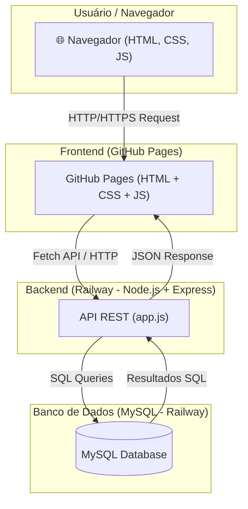
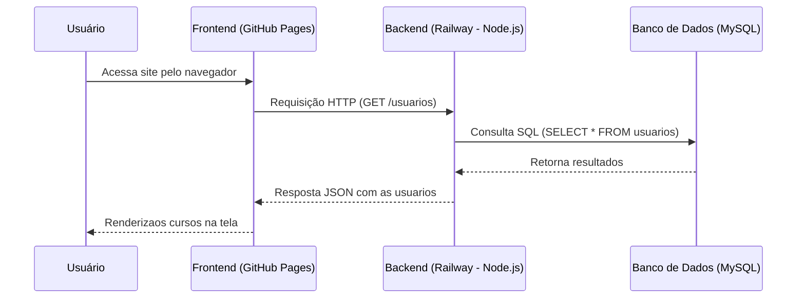

 🎓 Projeto Educa-Cursos

O **EducaCursos** é um sistema de gerenciamento de conteúdo que possibilita você aprender online  em ambiente web.  
O objetivo deste curso é capacitar os alunos nas áreas de Desenvolvimento Web, Marketing Digital e Design Gráfico, oferecendo uma formação completa que une tecnologia, criatividade e estratégias de comunicação. Ao final do curso, o participante será capaz de criar sites profissionais, elaborar campanhas digitais eficazes e desenvolver materiais visuais atrativos, atendendo às demandas do mercado atual.  

**As principais funcionalidades incluem:**  

Página inicial institucional – apresenta a identidade do curso, missão e visão.

Seção de cursos – descrição detalhada de cada curso (Web, Marketing Digital, Design Gráfico) com objetivos e conteúdos.

Formulário de inscrição/contato – permite que os interessados entrem em contato ou se inscrevam online.

Área de depoimentos ou avaliações – espaço para feedback de alunos.

Blog ou artigos – publicações sobre tendências de tecnologia, marketing e design, agregando valor e melhorando o SEO.

Integração com redes sociais – botões ou links diretos para compartilhar e acompanhar novidades.

Galeria de projetos ou portfólio – exibição de trabalhos feitos pelos alunos ou pela equipe do curso.

Redirecionamento rápido (como já tem no seu código) – leva o usuário diretamente para a página principal sem precisar navegar manualmente.

Design responsivo – o site se adapta para celular, tablet e desktop.

Área restrita (opcional) – espaço exclusivo para alunos acessarem materiais, aulas gravadas ou certificados. 

---

## 🚀 Tecnologias Utilizadas
- **Frontend:** HTML, CSS, JavaScript  
- **Backend:** Node.js + Express  
- **Banco de Dados:** MySQL  
- **Hospedagem:**  
  - Frontend: GitHub Pages  
  - Backend & Banco: Railway  

---

## 📊 Arquitetura
O sistema segue a arquitetura **cliente-servidor**.  



---

## 📂 Estrutura do Projeto
```
/frontend      → Código do site (HTML, CSS, JS)
/backend       → API em Node.js + Express
  ├── js/
  │   ├── app.js       → Ponto de entrada
  │   ├── db.js           → Conexão com o banco
  │   ├── controllers.js  → Lógica da aplicação
  ├── sql/                → Scripts SQL para criação de tabelas
```

---

## 🔄 Fluxo de Requisição


---

## 💻 Como Executar Localmente

### 1. Clonar o repositório
```bash
git clone  https://github.com/FredTec13/educa-cursos.git
cd educa-cursos
```

### 2. Configurar Backend
```bash
cd backend
npm install
```

### 3. Criar arquivo `.env`
```env
DB_HOST=localhost
DB_PORT=3306
DB_USER=root
DB_PASSWORD=""
DB_NAME=USUARIOS
PORT=5000
```

### 4. Rodar o servidor
```bash
npm start
# ou
node --require dotenv/config js/app.js
```

A API estará disponível em:  
👉 http://localhost:5000  

---

## 🌍 Deploy em Produção

No **Railway**, configurar as variáveis de ambiente:  
- DB_HOST  
- DB_PORT  
- DB_USER  
- DB_PASSWORD  
- DB_NAME  
- PORT  

Após isso, o backend ficará disponível online e o frontend no GitHub Pages poderá consumir a API.  

---

## 🔧 Extensões VSCode Recomendadas
- **Material Icon Theme** → Ícones de arquivos e pastas.  
- **Live Server** → Executa projeto localmente.  
- **Live Preview** → Pré-visualização de HTML.  
- **Code Runner** → Executa scripts JS no terminal.  

---

## 📑 Atalhos HTML Semântico
- `.nome` → Cria uma div com classe "nome".  
- `section.nome` → Cria uma section com classe "nome".  
- `section#nome` → Cria uma section com id "nome".  
- `section.nome1#nome2` → Cria uma section com classe "nome1" e id "nome2".  

---

## ⌨️ Atalhos VSCode
- `Alt + Shift + i` → Edição em várias linhas.  
- `Ctrl + F2` → Seleciona todas as ocorrências de um termo.  
- `Ctrl + ;` → Comenta/descomenta linhas.  
- `Alt + Z` → Quebra automática de linha.  

---

## 📚 Referências
- [MDN Web Docs](https://www.mg.senac.br/)  
- [W3Schools](https://www.w3schools.com/)  

---

## ⚙️ Git Config Utils
```bash
git config --global user.email "you@example.com"
git config --global user.name "Your Name"

